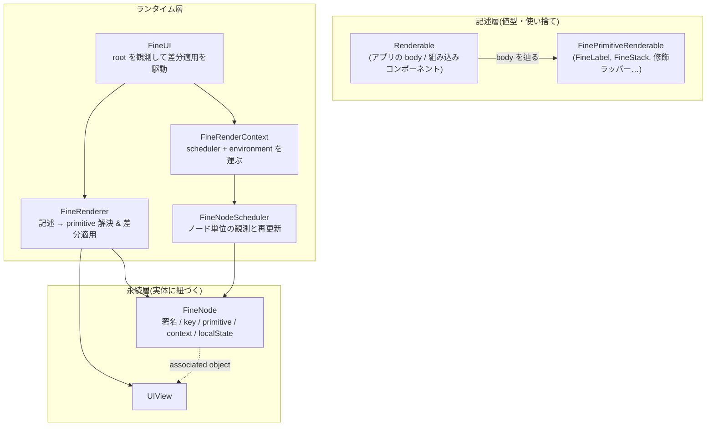
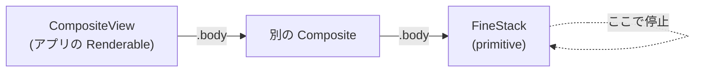
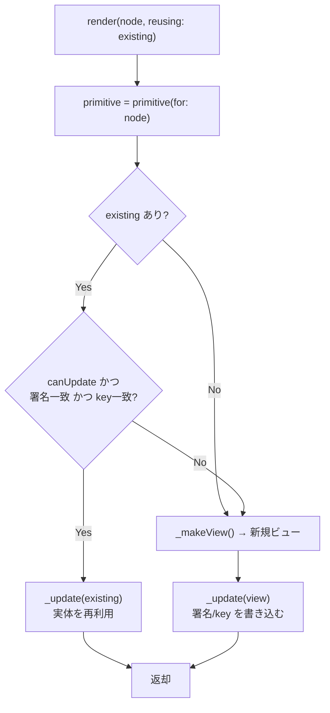
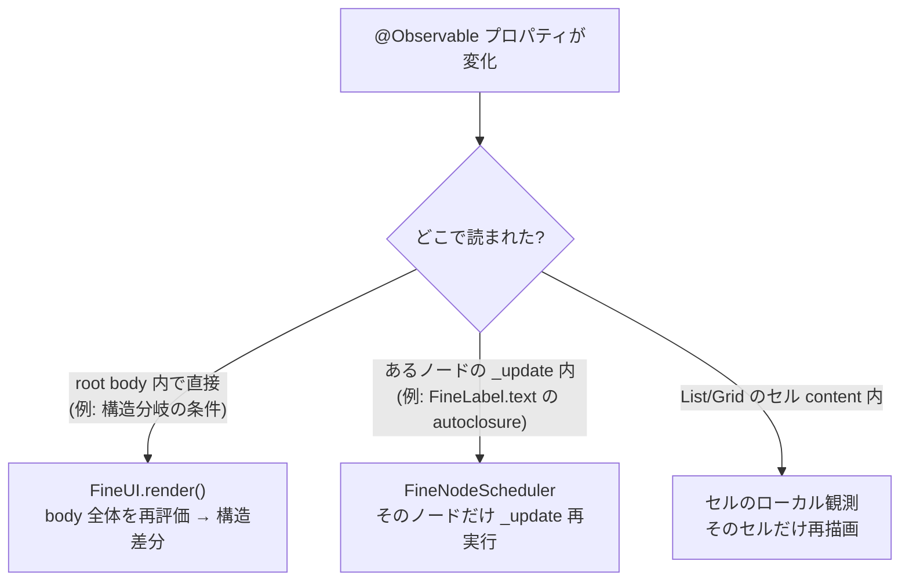
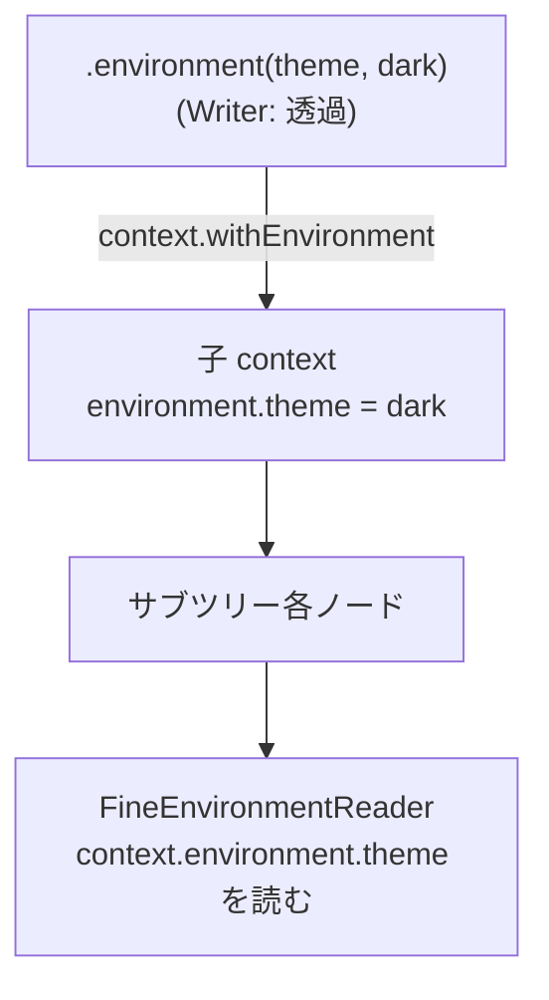
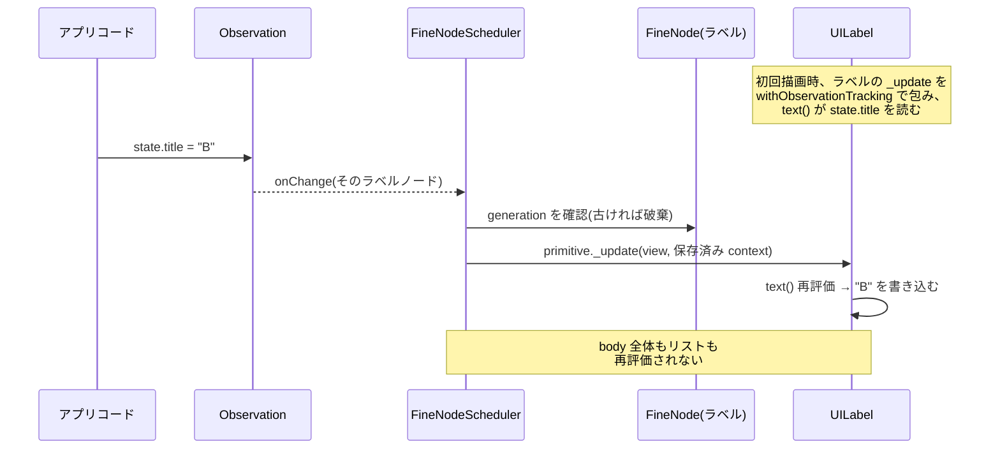

# FineUIKit 内部アーキテクチャ

UIKit の上に宣言的 UI を実現する FineUIKit の内部構造を解説します。
「UI を**記述(データ)**として扱い、ランタイムが `UIView` へ**差分適用**する」という Rust の [Dioxus](https://dioxuslabs.com) と同じ方針を、UIKit + Swift の [Observation](https://developer.apple.com/documentation/observation) 上で実装しています。

対象読者は、FineUIKit を拡張する人・内部を理解して使いたい人です。公開 API の使い方は [README](../README.md) を参照してください。

---

## 1. 設計思想

宣言的 UI フレームワークは大きく2つの系譜があります。

- **VDOM 再構築型**(React): 記述ツリー全体を毎回作り、前回との差分を求めて DOM に適用する。
- **fine-grained reactivity 型**(Solid.js / Svelte): 記述は一度きり構築し、リアクティブな部分式だけが再実行されて対象を直接更新する。

FineUIKit は **両者のハイブリッド**です。

- 記述(`Renderable`)は軽量な値型で、必要に応じて作り直す(React 的)。
- ただし `@Observable` の**読み取り位置**に応じて、再評価の粒度が「root の `body` 全体」「ノード単位」「セル単位」に自動で絞られる(Solid 的)。

そして記述と実体(`UIView`)を明確に分離し、両者の対応・差分状態は **`FineNode`(永続的な「要素」)** が保持します。これは Flutter の Widget / Element / RenderObject 三層に対応します。

| Flutter | FineUIKit | 役割 |
|---|---|---|
| Widget(不変の設定) | `Renderable` | UI の記述。毎回作り直してよい |
| Element(永続インスタンス) | `FineNode` | 記述と実体の対応・差分状態・ローカル状態を保持 |
| RenderObject(レイアウト/描画) | `UIView` | 実際のレイアウトと描画 |

---

## 2. 全体像



主要ファイル:

| ファイル | 役割 |
|---|---|
| `Renderable.swift` | 公開プロトコル `Renderable` と内部契約 `FinePrimitiveRenderable` |
| `FineRenderer.swift` | 記述→primitive 解決と in-place 差分適用の中核 |
| `FineNode.swift` | 実体に紐づく永続「要素」 |
| `FineNodeScheduler.swift` | ノード単位の `withObservationTracking` による再更新 |
| `FineRenderContext.swift` | scheduler と environment を子孫へ運ぶ |
| `FineUI.swift` | root の `body` を観測して差分適用を駆動するランタイム |
| `UIView+Fine.swift` | `UIView` に `FineNode` を紐づける associated object |

---

## 3. 中核抽象: `Renderable` と primitive

公開プロトコルは `body` だけを持ちます(`Renderable.swift`)。

```swift
@MainActor
public protocol Renderable {
    var body: any Renderable { get }
}
```

アプリ側は `body` の中で組み込みコンポーネントを合成します。SwiftUI の `View.body` と同じ構図です。

一方、組み込みコンポーネント(`FineLabel` 等)は内部プロトコル `FinePrimitiveRenderable` に準拠し、`UIView` を作る/更新する契約を実装します。

```swift
@MainActor
protocol FinePrimitiveRenderable: Renderable {
    func _makeView() -> UIView                       // 実体を作る
    func _canUpdate(_ view: UIView) -> Bool          // この実体を再利用できるか
    func _update(_ view: UIView, context: FineRenderContext)  // 実体へ書き込む
    var _modifierSignature: String { get }           // 修飾構成の署名
    var _key: AnyHashable? { get }                    // 安定 identity
}
```

primitive の `body` は評価されません(`fatalError`)。primitive は木の**葉**であり、それ以上 `body` で分解されないためです。

### body の解決

`FineRenderer.primitive(for:)` は、`body` を最大 64 段辿って最初に見つかる primitive を返します(`FineRenderer.swift`)。



これにより「アプリの記述 → 組み込み primitive」の変換が行われ、以降は primitive の `_makeView` / `_update` 契約だけを相手にします。

なお、公開プロトコル `FineViewRepresentable`(任意の `UIView` をラップする拡張ポイント)は、デフォルトの `body` が内部アダプタ `FineRepresentableAdapter` を返すことでこの解決ループに自然に合流します(`FineViewRepresentable.swift`)。レンダラー側に特別な分岐はなく、準拠型が `body` を独自実装すればそちらが優先されます。署名には representable の具象型名が入るため、同じ `ViewType` を持つ別の representable と実体を共有することはありません。

---

## 4. 差分適用(reconciliation)

`FineRenderer.render(_:reusing:)` が中核です(`FineRenderer.swift`)。既存 `UIView` を渡すと、**互換なら in-place 更新、非互換なら作り直し**を行います。

再利用の可否は3条件の AND:

1. `node._canUpdate(existing)` — ビュー型が一致するか(例: `view is UILabel`)
2. `existing.fineModifierSignature == node._modifierSignature` — 修飾構成の署名が一致するか
3. `existing.fineKey == node._key` — 安定 identity が一致するか



この「型 + 署名 + key」の一致判定が、FineUIKit の差分適用の心臓です。3つのうち1つでも変われば実体は作り直され、古いスタイルが残留しません。

> **通常パス(`FineUI` 経由)での実行タイミング**: `FineRenderer.render` は、コンテキストに scheduler があるとき冒頭で `FineNodeScheduler.renderChild` へ委譲します(`FineRenderer.swift`)。3条件の一致判定は同一ですが、そこでは `_update` は即時実行されず**キューに積まれ、`drain()` でまとめて遅延実行**されます(§7)。上の図は scheduler 不在時(`FineRenderer.render` 直呼び、テスト等)の同期経路で、判定ロジックの本質は両経路で共通です。

---

## 5. `FineNode`: 永続要素

`FineRenderer` の判定に使う状態(署名・key)や、ノード単位の観測状態は、記述ではなく**実体側**に置く必要があります(記述は毎回作り直されるため)。これを担うのが `FineNode` です(`FineNode.swift`)。

```swift
@MainActor
final class FineNode {
    var modifierSignature: String = ""      // 再利用判定に使う修飾署名
    var key: AnyHashable?                    // 安定 identity

    var primitive: (any FinePrimitiveRenderable)?  // 最後に適用した primitive
    var generation = 0                       // 世代(古い更新ジョブの無効化)
    var context: FineRenderContext?          // 最後の描画コンテキスト(environment を含む)

    var localState: AnyObject?               // FineState のローカル状態
}
```

`FineNode` は `UIView` に associated object として1つだけ紐づきます(`UIView+Fine.swift`)。

```swift
extension UIView {
    var fineNodeIfPresent: FineNode? { /* 取得のみ、無ければ nil */ }
    var fineNode: FineNode { /* 取得 or 生成 */ }

    // 後方互換の転送プロパティ。getter はノードを生成しない(不在=既定値)
    var fineModifierSignature: String { get { fineNodeIfPresent?.modifierSignature ?? "" } set { ... } }
    var fineKey: AnyHashable? { get { fineNodeIfPresent?.key } set { ... } }
}
```

`FineNode` は実体(`UIView`)と同寿命です。ビューが再利用される限りノードも生き続けるため、**ローカル状態や environment を再レンダリングをまたいで保持**できます。これが Flutter の Element に相当する「永続層」です。

---

## 6. モディファイアシステム

`.padding(16)` や `.backgroundColor(.systemGray6)` のような修飾は、**記述をラップする primitive** として表現されます。ラッパーには2種類あります。

### 透過ラッパー(同じ実体に適用)

`FineStyled`(`FineStyled.swift`)や `FineConstrained` は、`_makeView` / `_canUpdate` / `_update` を**中身の primitive に委譲**し、`_update` の後に自分のスタイル適用を追加します。つまり**新しいビューを作らず**、同じビューにプロパティを書き込みます。

```swift
func _update(_ view: UIView, context: FineRenderContext) {
    FineRenderer.primitive(for: content)._update(view, context: context)
    for style in styles { style.apply(view) }
}

var _modifierSignature: String {
    FineRenderer.primitive(for: content)._modifierSignature + "|" + styles.map(\.key).joined(separator: "|")
}
```

**署名にモディファイアのキーと順序が畳み込まれる**のがポイントです。`.backgroundColor().padding()` と `.padding().backgroundColor()` は署名が異なるため、構成が変わると in-place 更新ではなく作り直しになり、古い装飾が残りません。値だけの変化(色や inset の数値)は署名が同じなので高速に in-place 反映されます。

### ホストラッパー(実体を内包する)

`FinePadded`(`FinePadded.swift`)や `FineFramed`、`FineLifecycleModified` は、**独自のコンテナビューを持ち、中身をサブビューとして制約で敷き詰めます**。padding のように「余白を持つ別レイヤー」が必要な場合に使います。

```swift
func _update(_ view: UIView, context: FineRenderContext) {
    let paddingView = view as! FinePaddingView
    let hosted = context.render(content, reusing: paddingView.hosted)  // 中身を再帰的に描画
    if hosted !== paddingView.hosted { /* サブビュー差し替え + 制約張り直し */ }
    paddingView.topConstraint?.constant = insets.top  // 値は in-place 更新
}
```

透過ラッパーが「同じビューへの追記」、ホストラッパーが「ビュー階層に1層挟む」という違いです。順序に意味がある(README「モディファイア」節)のはこの合成のためです。

---

## 7. `FineNodeScheduler`: fine-grained な観測

FineUIKit のリアクティビティの要が `FineNodeScheduler`(`FineNodeScheduler.swift`)です。コンテナ配下の各ノードを描画するとき、**各 primitive の `_update` を個別の `withObservationTracking` で包みます**。

```swift
private func run(_ job: Job) {
    guard view.fineNodeIfPresent?.generation == job.generation else { return }  // 古いジョブは破棄
    withObservationTracking {
        job.primitive._update(view, context: job.context)     // この更新で読んだ @Observable を追跡
    } onChange: { [weak self, weak view] in
        Task { @MainActor in
            guard view?.fineNodeIfPresent?.generation == generation else { return }
            self?.enqueueExisting(view!)   // そのノードだけ再更新キューに積む
            self?.drain()
        }
    }
}
```

つまり、**あるノードの `_update` 中に読んだ `@Observable` プロパティが変わると、そのノードの `_update` だけが再実行**されます。`body` 全体は再評価されません。

### 世代(generation)による無効化

ノードが作り直されたり再更新が積まれるたびに `generation` を進めます。観測コールバックは自分が登録された世代を覚えており、現在の世代と一致しないジョブは破棄します。これにより、作り直された古いビューへの stale な更新や二重更新を防ぎます。

### `context` の保持と再利用

`run` に渡る `context`(scheduler と environment を含む)は `FineNode.context` に保存されます。ノード局所の再更新時はこの保存済み context が再利用されるため、**environment は別途コピーせずともノードに載って保持されます**(後述)。

---

## 8. `FineUI`: ランタイム

`FineUI`(`FineUI.swift`)は root を駆動します。`build(to:)` で最初の描画を行い、`render()` で `body` を観測付きで評価します。

```swift
private func render() {
    generation += 1
    let description = withObservationTracking {
        self.body(self.state)      // body の中で直接読んだ @Observable を追跡
    } onChange: { [weak self] in
        Task { @MainActor in
            guard self?.generation == expectedGeneration else { return }
            self?.render()          // 構造の再評価
        }
    }

    let scheduler = FineNodeScheduler()
    let context = FineRenderContext(nodeScheduler: scheduler)
    let rendered = FineRenderer.render(description, reusing: rootView, context: context)
    scheduler.drain()              // 積まれたノード更新を実行
    // rootView をコンテナに敷き詰める(keyboardLayoutGuide 追従など)
}
```

### 再レンダリングの3階層

「どこで `@Observable` を読んだか」で再評価の粒度が決まります。これが FineUIKit の効率の肝です。



- **root**: `body(state)` の中で `state.flag` を直接読み、`if state.flag { A } else { B }` のように**構造**が変われば、`render()` が丸ごと走り差分適用される。
- **ノード**: `FineLabel(text: state.title)` は `text` が `@autoclosure`(`FineLabel.swift`)なので、`state.title` の読み取りはラベルの `_update` 内で起きる。→ ラベルノードだけ再更新。
- **セル**: `FineList` / `FineGrid` のセルは独自の観測スコープで content を描画するため、行の内容変更はそのセルだけを更新する(後述)。

---

## 9. keyed diff(スタックの子照合)

`FineStack`(`FineStack.swift`)は子を差分照合します。既定は**位置ベース**、`FineForEach` / `.key(_:)` を与えると**key ベース**になります。

```swift
// 既存の子を key 付き / 無しに分類
for oldView in oldViews {
    if let key = oldView.fineKey { keyedOldViews[key] = oldView }
    else { unkeyedOldViews.append(oldView) }
}
// 新しい子を描画:key があれば同じ key の旧ビューを、無ければ位置で再利用
let newViews = content().map { node in
    if let key = primitive._key {
        return context.render(node, reusing: keyedOldViews.removeValue(forKey: key))
    }
    let reusable = unkeyedOldViews[safe: unkeyedIndex]; unkeyedIndex += 1
    return context.render(node, reusing: reusable)
}
```

`.key(_:)` / `FineForEach` は `FineKeyed`(`FineKeyed.swift`)という透過ラッパーを生成し、`_key` を返します。key を与えると、挿入・並び替え・削除で**同じ論理項目のビューが同一インスタンスのまま移動**するため、フォーカスやスクロール位置、そして `FineState` のローカル状態が保持されます。

`if/else` と `for-in`(`FineBuilder`)は位置ベースで照合されます。安定 identity が要る子には key を付けます。

---

## 10. 双方向バインディング

`FineBinding<Value>`(`FineBinding.swift`)は `get` / `set` のペアです。

```swift
public struct FineBinding<Value> {
    public var value: Value {
        get { get() }             // 描画中(観測スコープ内)に評価される
        nonmutating set { set(newValue) }
    }
}
```

- `get` はレンダリング中に呼ばれるため、バインド先の `@Observable` プロパティが観測登録され、外部変更で自動再描画される。
- UI 側の変更は `set` で状態へ書き戻る。`FineTextField` などは「現在値と異なるときだけビューに書く」ガードを持ち、入力中のカーソルを保てる(`FineTextField.swift`)。

同じ `FineBinding` はローカル状態(`FineState`)のハンドルとしても再利用されます。

---

## 11. Environment(アンビエント値の伝播)

environment は `FineRenderContext` に相乗りして木を下ります(`FineRenderContext.swift`, `FineEnvironment.swift`)。

```swift
public struct FineRenderContext {
    let nodeScheduler: FineNodeScheduler?
    var environment: FineEnvironmentValues

    func withEnvironment(_ transform: (inout FineEnvironmentValues) -> Void) -> FineRenderContext {
        var env = environment; transform(&env)
        return FineRenderContext(nodeScheduler: nodeScheduler, environment: env)  // scheduler は保持
    }
}
```

- `.environment(\.key, value)` は**透過ラッパー** `FineEnvironmentWriter` を生成し、`_update` で `context.withEnvironment { … }` を作って中身の primitive に渡すだけ(ビューを増やさない)。
- `FineEnvironmentReader { env in … }` は**ホスト型**で、`_update` 時に `context.environment` から記述を生成する。

environment はレンダリングパスの値であり、`FineNode.context` に保存されるため、**ノード局所の再更新でも保存済み context 経由で参照でき、注入値が保持されます**。別途ノードへ複製する必要はありません。



---

## 12. ローカル状態(`FineState`)

`FineState`(`FineState.swift`)は SwiftUI の `@State` に相当する identity スコープの状態です。状態は**ホストビューの `FineNode.localState`** に置かれます。

```swift
func _update(_ view: UIView, context: FineRenderContext) {
    let host = view as! FineStateReaderView
    // ノードから状態を取得 or 初期値で生成(不在時のみ)
    let storage = (host.fineNode.localState as? FineStateStorage<Value>)
        ?? { let s = FineStateStorage(initialValue); host.fineNode.localState = s; return s }()

    let binding = FineBinding(get: { storage.value }, set: { storage.value = $0 })
    let node = content(binding)
    // 中身をホストへ描画(context.render → scheduler 経由でノード局所観測が張られる)
    let rendered = context.render(node, reusing: host.hosted)
    // …敷き詰め
}
```

`FineStateStorage<Value>` は Observation フレームワークで観測可能なボックスです(generics 対応のため `ObservationRegistrar` を手書き)。

- `storage.value` を content 内(典型的には `FineLabel` の autoclosure)で読むと、scheduler のノード観測に登録される。
- `binding.value` を書くと、そのノードだけがノード局所で再描画される。→ **外部 ViewModel なしでローカル state が UI を駆動**。

`FineNode` はビューと同寿命なので、**親の再レンダリングをまたいで状態が保持**されます。ビューが作り直される(型・署名・key が変わる)ときは新しいノード=初期値から作り直しで、これは SwiftUI の identity 意味論と一致します。key を与えれば並び替えをまたいでも状態が追従します。

---

## 13. リスト / グリッド(セル単位の観測)

`FineList`(`FineList.swift`)/ `FineGrid` は `UITableView` / `UICollectionView` の diffable data source を使い、`Identifiable` の ID で常に keyed です。

2階層の効率化があります。

1. **リスト全体の差分**: `NSDiffableDataSourceSnapshot` で行の挿入・削除・移動を最小適用。ウィンドウ上では自動アニメーション。
2. **セル単位の観測**: 各ホストセルは `FineListHostCell.render` で content を**独自の `withObservationTracking` スコープ**で描画する(`FineList.swift`)。

```swift
private func renderTracked() {
    generation += 1
    withObservationTracking {
        context.render(makeNode(), reusing: self.hostedView)
    } onChange: { [weak self] in
        Task { @MainActor in
            guard self?.generation == expectedGeneration else { return }
            self?.renderTracked()   // このセルだけ再描画
        }
    }
}
```

これにより、行 content が読んだ `@Observable` プロパティは、**リスト全体の再 render なしにそのセルだけ**更新されます。`FineUI` の root 観測と同じ仕組みを、セルというスコープに縮小したものです。

`.reconfiguringOnlyChangedRows()`(値型要素向け)は、生き残った行のうち `==` で不一致のものだけ reconfigure する最適化です。

---

## 14. アニメーション(トランザクション)

`withFineAnimation`(`FineAnimation.swift`)は `@TaskLocal` のトランザクション値を設定します。

```swift
public func withFineAnimation<R>(_ animation: FineAnimation? = .default, _ body: () throws -> R) rethrows -> R {
    try FineTransactionContext.$current.withValue(animation.map { .animate($0) } ?? .disabled, operation: body)
}
```

状態変更をこれで包むと、その変更が誘発する**次の再レンダリング**が `UIView.animate` の中で差分適用されます。root(`FineUI.render`)・ノード(`FineNodeScheduler.run` の onChange)・セル(`FineListHostCell`)のいずれの再描画経路もトランザクション値を見て、同じビューへの in-place なプロパティ変更や制約 constant の変化をアニメーションします。ビューの作り直しや、スタックへの挿入・削除のクロスフェードは行いません。

なお、この「挿入・削除をアニメーションしない」は `FineRenderer` のビュー木差分(root / ノード / セルの in-place 経路)の話です。`FineList` / `FineGrid` の**行・アイテムの挿入・削除・移動は別機構**で、`NSDiffableDataSourceSnapshot` の適用によりウィンドウ上では自動でスライドアニメーションします(§13)。`withFineAnimation(nil)` で包んだ変更ではその diff アニメーションも抑止されます。

---

## 15. 他フレームワークとの対応

| 概念 | React | SwiftUI | Solid.js | FineUIKit |
|---|---|---|---|---|
| UI 記述 | JSX/Element | `View` | JSX | `Renderable` |
| 永続インスタンス | Fiber | (内部) | (なし/直結) | `FineNode` |
| リアクティビティ | VDOM diff | `@Observable`/`@State` | signals | Observation + ノード観測 |
| ローカル状態 | `useState` | `@State` | `createSignal` | `FineState` |
| アンビエント値 | Context | `@Environment` | Context | `.environment` / `FineEnvironmentReader` |
| リスト | key 付き children | `ForEach` | `<For>` | `FineList`/`FineGrid`/`FineForEach` |
| 双方向 | 制御コンポーネント | `Binding` | — | `FineBinding` |

FineUIKit の特徴は、**再評価の粒度が読み取り位置で自動的に決まる**(Solid 的 fine-grained)一方で、**構造変化は記述の作り直し + 差分適用**(React 的)で扱い、その対応関係を **`FineNode` という永続要素**(Flutter 的)が保持する、という3つの良いとこ取りにあります。

---

## 16. 1回の状態変更を追う(データフロー総まとめ)

例: `FineLabel(text: state.title)` の `state.title` が変わったとき。



- `state.title` を直接 `body` で読んでいれば root 再評価に、ラベルの autoclosure 内で読んでいればノード再評価に、セル content 内で読んでいればセル再描画に、それぞれ自動で振り分けられる。
- どの経路でも、最終的には `FineRenderer` の「型 + 署名 + key」判定を通って in-place 更新か作り直しが決まり、対応状態は `FineNode` に記録される。

---

## 参考

- 公開 API と使い方: [README](../README.md)
- 中核ファイル: `Renderable.swift` / `FineRenderer.swift` / `FineNode.swift` / `FineNodeScheduler.swift` / `FineUI.swift`
