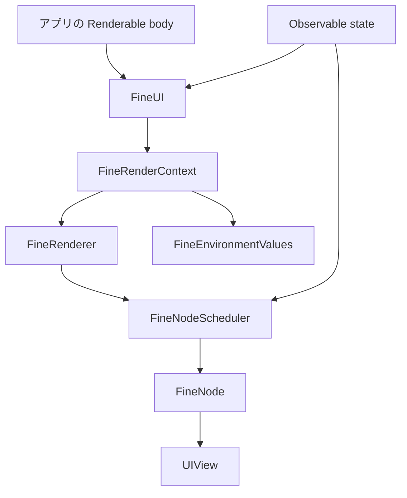

# レンダリングランタイムの構造

FineUIKit は、アプリが生成する軽量な UI 記述と、UIKit が保持する実ビューを分離します。`Renderable` は合成可能な記述、内部の `FinePrimitiveRenderable` は UIView の生成・互換性判定・更新を担います（[Renderable.swift](../../Sources/FineUIKit/Renderable.swift)、[FineRenderer.swift](../../Sources/FineUIKit/FineRenderer.swift)）。この構造は、公開 DSL と状態保持の意味を定める[UI 合成と状態](../domain/ui-composition.md)を支えます。

*ルート描画は `FineUI` が始め、子の更新は scheduler と `FineNode` を通じて UIKit の実ビューへ届きます。*

## 中核となる三層

| 層 | 実体 | 責務 |
|---|---|---|
| 記述 | `Renderable` | `body` で UI を合成する。使い捨ての値として再評価可能。|
| 永続要素 | `FineNode` | key、モディファイア署名、最後の primitive/context、世代、ローカル状態を UIView と同寿命で保持する。|
| 実ビュー | `UIView` | UIKit のレイアウト・描画・イベント処理を担う。|

`FineNode` は associated object として UIView に付加されるため、記述の再生成をまたいで `FineState` や再利用判定の情報を保持できます（[FineNode.swift](../../Sources/FineUIKit/FineNode.swift)、[UIView+Fine.swift](../../Sources/FineUIKit/UIView+Fine.swift)）。ノードは最後に描画した primitive(記述)も保持するため、`@FineBuilder` など escaping クロージャが `self` を強参照すると保持サイクルが閉じます。この契約と回避策は[UI 合成と状態の保持とキャプチャ](../domain/ui-composition.md#保持とキャプチャ)で扱います。

## 差分適用の契約

`FineRenderer` は `body` を最大 64 段たどって最初の primitive を解決し、渡された既存 UIView を再利用できるか判定します。判定は次の三条件すべてを要求します（`FineRenderer.reuses(_:for:signature:key:)`）。

1. primitive が既存ビューを更新可能であること（`_canUpdate`）。
2. モディファイア署名が一致すること。
3. key が一致すること。key なしの primitive では双方 `nil` として一致します。

解決の途中で通り過ぎたアプリ側の `Renderable` 型は捨てられません。`primitive(for:)` は通過した型名を集め、1 つ以上あれば結果を `FineComposite` で包んでモディファイア署名へ前置します（[FineComposite.swift](../../Sources/FineUIKit/FineComposite.swift)）。これがないと、別々の `Renderable` 型が同じ primitive に解決されたときに区別がつかず、入れ替えても in-place 更新されてノードの `FineState` まで引き継がれてしまいます。composite を 1 つも通らなかった記述（組み込みコンポーネントだけのツリー）は包まれず、署名も割り当ても増えません。

ただし「どの既存ビューを候補として渡すか」は親コンテナが決めます。`FineStack` は子を key の有無で分け、key 付きは `.key(_:)` の値で対応するビューを引き当て、key なしは並び順の位置で引き当てます（[FineStack.swift](../../Sources/FineUIKit/Components/FineStack.swift)）。したがって key を付けない限り identity は位置に依存し、要素の挿入・並べ替えでビューと `FineState` が別の子に付き替わります。安定させたい子には `.key(_:)` を付けてください。

`if` で生成される子が一方の render に現れ次に消えると、後続の key なし兄弟が一つずつ前に詰められ、無関係なビューが作り直されたり別の子の view と `FineState` を静かに引き継いだりしていました。`FineStructural`（[FineStructural.swift](../../Sources/FineUIKit/FineStructural.swift)）は `@FineBuilder` の `buildOptional` / `buildEither` / `buildArray` が生成した子に、記述の**静的**構造に基づくスロット（`path`）を `_key` として与えることで、それらを位置リストから外します。スロット付き子は key マッチングで再利用されるため、兄弟の位置は動かなくなります。`FineStructuralKey` は `path` に加えて `.key(_:)` の値（`user`）またはループ順序（`position`）のいずれか一つを持ち、`user` があれば `position` を捨てて key が reorder を追う設計です。`FineStack` の重複 key assert は、呼び出し側が選んだ `.key(_:)` の重複だけを報告し、ビルダが採番したスロット（`fineIsGeneratedSlot`）の衝突は無視します — 「誰が選んだか」が基準で、この判定はモディファイアが内側のスロットを隠したとき（`helper().map { $0.backgroundColor(…) }` が `FineStyled` を挟む場合）でも再帰的に下まで尋ねるため、作られたスロットが呼び出し側の key と誤認されません（commit `c15fc20`、`75d87aa`、`975b0c7`）。switch/else-if の各分岐は同じスロットを共有し、compatible ビューへの分岐切替は在来の in-place 更新を保ちます。直列の `buildBlock` はスロットを与えないため余分な wrapper を割り当てません。

**配列式にはスロットが付きません。** `items.map { … }` や `[a, b] + [c]` の子は素の並びとして扱われ、`buildExpression` は配列を素通りさせます（`975b0c7` で試みたスロット化は取り下げ）。配列が縮むと後ろの兄弟が繰り上がるため、長さの変わる並びの後ろに兄弟を置く場合は `for-in` で書きます。配列式へのスロット付与は「分岐が同じスロットを共有する（run が位置を消費する）」と「run の長さが後続に影響しない（位置を消費しない）」を同時に満たせず、スロットの代数の設計し直しが要るため、パッチでは解けないという判断が記録されています（[`docs/rendering.md`](../../docs/rendering.md) の警告が正本）。

候補が三条件を満たせば `_update` を既存ビューへ適用し、満たさなければ新しいビューを生成します。モディファイアの構成や key を変更すると、古い装飾・状態を引きずらずに再構築できる一方、局所状態は失われます。詳細な更新経路と観測粒度は[レンダリングワークフロー](../workflows/rendering.md)を参照してください。

## 役割分担

- `FineUI`(internal): root `body` を観測し、コンテナへの設置、trait 監視、可視性ゲート、DEBUG の hot-reload 監視を管理します。公開 API からは直接露出せず、`FineContentController` 経由で利用します（[FineUI.swift](../../Sources/FineUIKit/FineUI.swift)、[FineContentController.swift](../../Sources/FineUIKit/FineContentController.swift)）。ランタイムを非公開にした判断と根拠は [`docs/api-design.md`](../../docs/api-design.md) §7 にあります。
- `FineRenderer`: 記述の primitive 解決と、同期的な再利用判定を行います。解決時に通り過ぎた composite 型は `FineComposite` で包んで署名へ前置します（[FineComposite.swift](../../Sources/FineUIKit/FineComposite.swift)）。透過ラッパが 1 render で最大 5 回 `body` を再解決するのを防ぐため、ラッパは `FineResolvedRenderable`（[FineResolvedRenderable.swift](../../Sources/FineUIKit/FineResolvedRenderable.swift)）で primitive を遅延キャッシュします。root の署名取得は孤立したスコープで起きてしまうため、`FineRenderer.prime(_:)` が root の再利用 identity を root 自身の観測スコープ内で尋ねます（commit `75e52b0`）。
- `FineNodeScheduler`: 通常のツリーでは子ノードの `_update` を個別に観測し、該当ノードだけを再キューします（[FineNodeScheduler.swift](../../Sources/FineUIKit/FineNodeScheduler.swift)）。
- `FineRenderContext`: scheduler、render gate、environment、宣言的アニメーション要求を子孫へ渡します（[FineRenderContext.swift](../../Sources/FineUIKit/FineRenderContext.swift)）。
- `FineNodeHost`: List/Grid のセルや supplementary view 用に、独立した局所レンダーループを持ちます。この特殊経路は[UIKit 統合とコレクション](../integrations/uikit-collections.md)で扱います。

## 直近の設計上の優先事項

Git 履歴は、再調停の不要な仕事を減らす方向を明確に示しています。`044f24d` は composite の description を一回の render で何度も解決していたコストを削減し、`8a2f4e9` は構造・行内容・supplementary view に変化がない List/Grid の snapshot apply を省略しました。いずれも「`body` は副作用なし」という契約を前提にしています。

また `e56854e` は `build(to:)` で別コンテナを指定した際に、root view、制約、trait 監視を移す必要を明文化しました。ホストや再利用判定を変更する場合の確認方法は[テストと運用](../operations/testing.md)、実装の所在は[ソースマップ](../source-map.md)を参照してください。
