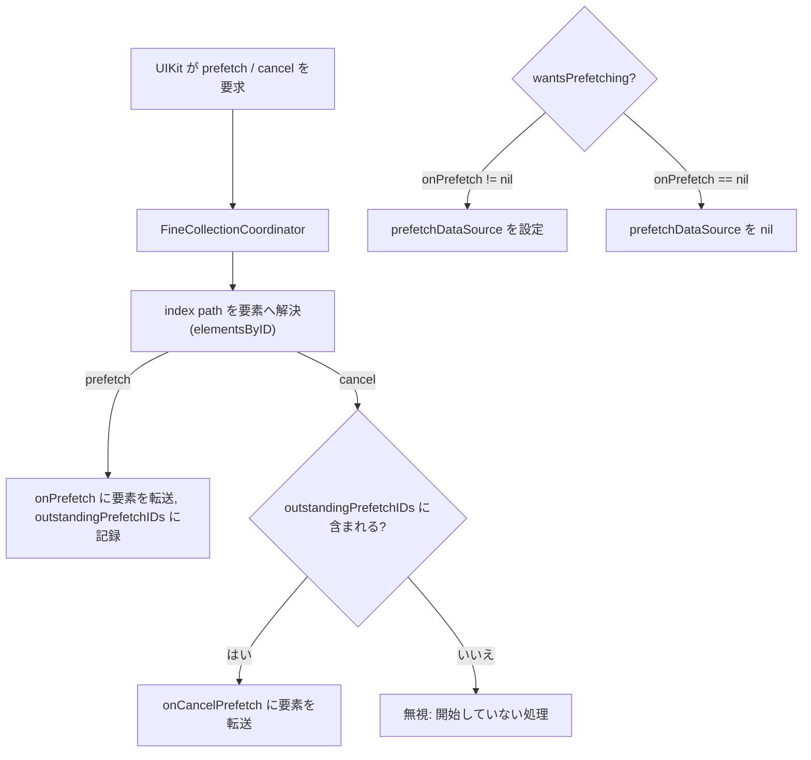

# UIKit 統合、ナビゲーション、List と Grid

FineUIKit は UIKit を置き換えず、`FineContentController` が `FineContent` を `UIViewController` へ、内部の `FineUI` が UIView 階層へ宣言的ツリーを設置します。更新粒度と停止・復帰の共通ルールは[レンダリングワークフロー](../workflows/rendering.md)、public DSL の状態・extension 規則は[UI 合成と状態](../domain/ui-composition.md)を参照してください。

## 画面とホスティング

画面として使う場合は `FineContentController` に `any FineContent` を渡します（`init(_ content:avoidsKeyboard:)`、`avoidsKeyboard` は既定で `true`）。`viewDidLoad` で内部の `FineUI` を生成し、自身の `view` へ `build(to:)` します（[FineContent.swift](../../Sources/FineUIKit/FineContent.swift)、[FineContentController.swift](../../Sources/FineUIKit/FineContentController.swift)、[FineUI.swift](../../Sources/FineUIKit/FineUI.swift)）。

`FineUI` は意図的に公開していません（`da73abc`）。mounting を自分で書くと suspend/resume のライフサイクル管理も自分で担うことになり、`suspend()` を忘れたツリーは画面外でも黙って再差分され続けます。`FineContentController` はそれを正しく行う唯一の場所です。公開 API の拡張は source-compatible ですが縮小は互換性を壊すため、必要が生じるまで閉じています（この判断の根拠は [`docs/api-design.md`](../../docs/api-design.md) §5）。自分のコントローラ内に埋め込む場合は、UIKit の containment 手順をすべて踏んでください — `addChild(_:)` は親子関係を結ぶだけでビューを足さないので、`addChild(_:)` → コンテナへの `addSubview(_:)` → 制約 → `didMove(toParent:)` の 4 段階が要ります。そうすれば外観遷移が転送され、画面外で停止する render loop も保たれます。

`build(to:)` を別コンテナで再度呼ぶと、同じ root view を移し、旧コンテナにまたがる制約と trait registration を外して新コンテナに再設置します。同じコンテナへの再 build は階層を壊さない idempotent な再レンダーです。この再ホスト経路は `e56854e` とその後の修正で強化され、`FineUIHostingTests.swift` が root 移動、制約の張り直し、状態と trait の追従を保護するため、変更時の必須確認先です。

## 宣言的 navigation

`FineNavigating` に適合すると `navigation() -> FineNavigation?` で `navigationItem` の title、prompt、large-title、back-button、leading/trailing button を宣言できます。`nil` は FineUIKit が navigation item に触れず、手動管理を維持する意味です（[FineNavigation.swift](../../Sources/FineUIKit/FineNavigation.swift)）。navigation が意味を持つのは画面としてマウントされたときだけです。サブビューへレンダリングされた content には書き込む先の bar が無いため、`FineContent.swift` は `FineContent` と `FineNavigating` を分離しています — 適合を禁じているのではなく、その位置では実装しても何も起きないメソッドを生やさない、という分け方です。

navigation は body から分離された observation scope です。タイトルや button の enabled 状態の変更は navigation item だけを更新し、view tree を再調停しません。また、画面本体が非表示で停止中でも navigation は更新されます。後ろの画面の title が上の画面の back-button label として表示されるためです。

bar button の action は既存の `UIAction.primaryAction` を最新 closure に置換して再利用します。button kind/style を変える実装では、古い識別子・title・image・action が残らないことを確認してください。これは `c7589e9`、`00fa51e` による回帰修正の対象でした。

## FineList と FineGrid

`FineList` は `UITableViewDiffableDataSource`、`FineGrid` は `UICollectionViewDiffableDataSource` と compositional layout に基づきます。いずれも `Identifiable` な item、section、header/footer、selection、refresh、keyboard dismiss を扱い、Grid は固定列数または adaptive 最小幅を指定できます（[FineList.swift](../../Sources/FineUIKit/Components/FineList.swift)、[FineGrid.swift](../../Sources/FineUIKit/Components/FineGrid.swift)）。

`fe0a733` 以降、両者の section は**同じ型** `FineSection<Element>` です（[FineCollection.swift](../../Sources/FineUIKit/Components/FineCollection.swift)）。`FineListSection` / `FineGridSection` はその typealias であり、1 つの section 値をどちらにも渡せます。差分ロジック（`plan(sections:reconfiguresAll:areElementsEqual:name:) → FineCollectionPlan` と `commit(_:)`）は共有の `FineCollectionCoordinator<Element>` に一本化され、テーブルとコレクションそれぞれに存在した section-Folding / `reconfiguredIDs` 補助付き signature 確認 / `needsApply` / snapshot 構築 / refresh 制御は重複しません。ヘッダー・フッターの enum は `FineSupplementaryKind`（`.header` / `.footer`）に統一され、`elementKind: String` は UIKit 境界でのみ変換します（List はかつて `Bool isHeader`、Grid は raw `String` を使っていました）。この後退（挙動の prior 差）は [`docs/components.md`](../../docs/components.md) で公に意図されます。`FineSection` 以外の同領域シンボル（`FineCollectionCoordinator`、`FineCollectionPlan`、`FineSupplementaryKind` など）は内部です。

### identity と更新ポリシー

- section ID と item ID は、各コレクション内で一意である必要があります。重複は assertion とスキップの対象です。
- surviving item は、比較可能な要素なら値変化時だけ reconfigure します。`@Observable` な参照モデルをセル内で読む場合はセル局所観測が更新を担います。
- element 外の非 Observable な capture を行表示に使う場合は、`.reconfiguringAllRows()` / `.reconfiguringAllItems()` を選びます。changed-only 設定では `Equatable` が表示内容全体を覆う必要があります。
- header/footer は snapshot の一部ではありません。section identity で supplementary view を追跡・更新する必要があります。

直近の `8a2f4e9` は、構造、reconfigure 対象、supplementary signature に変化がない場合の snapshot apply を省略しました。root の別 state（たとえばテキスト入力）で List/Grid が不要に全 diff されないことは維持すべき性能契約です。この省略判定は `FineCollectionPlan.needsApply` で行われ、`commit(_:)` は apply が行われたときだけ `appliedSectionIDs` / `appliedItemIDs` / `appliedSupplementarySignature` を記録します（Grid はレイアウト無効化のため `supplementaryDidChange` を `needsApply` の前に読みます）。

## 横に並ぶもの — FineCarousel と FineShelf

`FineList` と `FineGrid` は縦に伸びますが、**横**の形は 2 つあり、ともに表現できませんでした（`1231495`）。`FineCarousel`（横ページング、1 要素 = 1 ページ）と `FineShelf`（横スクロールの 1 列）は `UICollectionView` に基づく `FinePrimitiveRenderable` です（[FineCarousel.swift](../../Sources/FineUIKit/Components/FineCarousel.swift)、[FineShelf.swift](../../Sources/FineUIKit/Components/FineShelf.swift)）。公開 API と対応 UIKit クラスの一覧は [`docs/components.md`](../../docs/components.md) の横形状節が正本です。

### 共通の基盤 — FineFlatCollectionCoordinator

両者はセクション・ヘッダー・フッターを持たない「並び」で、差分ロジックが不要な一本化の典型です。`FineFlatCollectionCoordinator<Element>`（[FineCollection.swift](../../Sources/FineUIKit/Components/FineCollection.swift)）は `FineCollectionCoordinator` に `UICollectionViewDelegate` / `UICollectionViewDataSourcePrefetching` を足した基底で、固定 1 セクションの diffable data source と cell provider、`onSelect`、prefetch 転送をここに書き、各コンポーネントは自身を特徴づけるものだけを足します。cell provider は coordinator を collection view 経由で引き当てて retain cycle を避け、セルは `usesGivenSize = true` で与えられた大きさに従います（ページはカルーセル幅いっぱい、shelf 項目は shelf 高さいっぱい）。`scrollOffsetDidChange(in:)` はこのクラスが `UICollectionViewDelegate` 適合を持つためここに宣言し、基底では空、`FineCarousel.Coordinator` が現在ページ報告のために override します — UIKit は適合を宣言したクラスでデリゲートメソッドを探すため、下位で足しただけの scroll コールバックは呼ばれません。

### FineCarousel — 1 画面ずつのページ

`FinePageControl` は最初からありましたが組み合わせる相手がなく、ページングを自前で書く必要がありました。`.currentPage(_:)` は page control と同じ `FineBinding<Int>` を受け取るので、2 つで 1 つのことを記述します。カルーセルは `isPagingEnabled = true` の scroll view の上に fractional width/height のページを敷き、`contentInsetsReference = .none` でセーフエリアを引きません（ツリーの上位が既に処理しているため）。

binding は双方向です。スクロールが落ち着くと現在ページが binding へ書かれ（`reportPageIfChanged`、`scrollOffsetDidChange` 経由、全 offset 変化で報告するためドットは指に追従します）、binding への書き込みはそこへスクロールします。**今表示中のページを指す書き込みは何もしません** — これが 2 つの方向が追いかけ合わない仕掛けです。指が動いている最中（`isDragging` / `isDecelerating`）の書き込みは `pendingPage` に留め、ジェスチャ終了時に `applyPendingPage` で適用します（`scrollViewDidEndDragging` / `scrollViewDidEndDecelerating`）。初回レンダーがレイアウト前（幅 0）に起きるため、`currentPage` を持つカルーセルの開始ページは `FineCarouselView.layoutSubviews` が幅を得たときに `applyPendingPage` を呼んで届けます — 幅が決まることは tree が聞く変更ではないため、自分で聞く必要があります。

範囲外のページを指す書き込みは clamp し、**clamp 結果を binding へ書き戻します**（アプリがトラップする index を持ち続け、ドットが末尾を越えないように）。リストが縮んで表示中ページが消えた場合も、着地したページを報告します。スクロールは常に `animated: false` — tree が state に追いつく経路で、画面外で変わったページに動きはないためです。

### FineShelf — 横に流れる一列

「続きを見る」「最近再生した」の形です。`itemWidth` は `.fixed(pt)` か `.fractional(比率)`（`FineShelfItemWidth`）。1 未満の比率は次項目を端に覗かせ、読み手が横に続きがあると分かるようにします。compositional layout は group が幅を持ち item がそれを埋める設計で、両者に同じ fractional width を与えると乗算されてしまう（0.8 が 0.64 になる）のを避けます。`spacing` は `interGroupSpacing` です。`itemWidth` / `spacing` の変更は `LayoutConfiguration` の比較で検知し `invalidateLayout` します。高さは自身では決めず `.height(_:)` か `.frame(height:)` で与えます（`UICollectionView` と同じ）。

### 表示される前に知る — prefetch（`.onPrefetch` / `.onCancelPrefetch`）

行の記述はセルが構成される瞬間に組み立てられます。その中に遅いもの（リモート画像、デコードの要るアセット）があると、開始が遅すぎて行がポップインします。`.onPrefetch` / `.onCancelPrefetch`（`b7cf6b0` / `0ba11a0` 以降、`b6770d7` で listen する者がいるときだけ請求に修正）は UIKit の予告を `FineCollectionCoordinator` 経由で転送する入口で、`FineList` / `FineGrid` / `FineCarousel` / `FineShelf` すべてにあります（[FineCollection.swift](../../Sources/FineUIKit/Components/FineCollection.swift) の `prefetchElements(withIDs:)` / `cancelPrefetchingElements(withIDs:)`）。

*ランタイムは先読みせず、UIKit の予告を要素として転送するだけです。prefetchDataSource の有無は onPrefetch ハンドラの有無に一致します。*

prefetch の契約を変えるときに知っておくべき制約です:

- **ランタイムは何も先読みしません。** 高い処理はアプリの content クロージャの中にあるため、できるのは予告の転送だけです。渡されるのは index path ではなく**要素**で、差分適用で index が意味を失うためです。
- **`prefetchDataSource` は `.onPrefetch` があるときだけ設定されます。** `wantsPrefetching` は `onPrefetch != nil` だけで決まり、`fineUpdatePrefetching(on:with:)` が設定/除去します。**`.onCancelPrefetch` 単独では何も起きません** — キャンセルは始まった処理の話で、開始を報告する者がいなければ正直にキャンセルできるものもないためです。
- **`.onCancelPrefetch` は対応関係のある呼び出しではありません。** 表示された行は使われるだけで報告されず、コレクションから消えた要素も報告されません（それを知っているのは削除したコード自身）。`outstandingPrefetchIDs` が「実際に予告した要素」だけを追跡するのはこのためで、並べ替え後の cancel が無関係な行を指せば無視されます。既に終わった処理について呼ばれることはあるので冪等に書いてください。
- スクロール中にメインアクターで呼ばれるため、ここで処理を行わず投げてください。UIKit がどれだけ先を読むかは UIKit が決め、同じ行を複数回要求することもあります（繰り返しは畳まず転送します）。

## セルの局所描画と再利用

セルと supplementary view は `FineNodeHost` を持ちます。`75e52b0` 以降、ホストはセルごとに専用の `FineNodeScheduler` を持ち、セル content 内の Observable 読み取りをノード単位で追跡します（それ以前は行全体が単一スコープで、1 つの値の変更が行の全ビューを書き直していました）。environment の変化は可視セルへ伝播し、内容の高さ変化は table の行高無効化、collection layout invalidation へつながります。非表示中に観測が抑止されたセルは、ホストが自身の復帰を処理し（`recoversSuspendedWork`）、未変更 item が stale のまま残りません（[FineNodeHost.swift](../../Sources/FineUIKit/FineNodeHost.swift)、[FineNodeScheduler.swift](../../Sources/FineUIKit/FineNodeScheduler.swift)）。

### 行バウンドのライフサイクル

`onAppear` / `onDisappear` / `.task` は**表示している行**のライフを表し、セルという UIView の window ライフではありません（`693bb45`）。再利用された visible セルに別の行を渡しても window 遷移は起きないため、かつては前の行が消えたことも新しい行が現れたことも感知されませんでした。`FineLifecycleView` は「window にある」かと「記述が適用された」かを分離し、`setLifecycle(...)` は記述適用後に `notifyAppearIfNeeded()` を、`fineStopIdentityWork()` は行が終わったときに `disappear` を notify します。ホストが identity 変更を知るのはこの分離の外部契機です。

`FineIdentityScopedView` プロトコル（[FineIdentityScopedView.swift](../../Sources/FineUIKit/FineIdentityScopedView.swift)）は、記述のためにビューが保持する状態（lifecycle task、キーボード focus、scroll offset）をホストが巻き下ろすための統一インターフェースです。ホストは `discardIdentityState(in:keepingLocalState:)` でサブツリーを走査し、2 つの状況を区別します（`a87efd7`）:

- **駐車（`prepareForReuse` → `invalidate()`）**: 次に何を表示するか不明。`fineStopIdentityWork()` で lifecycle task とキーボードを止めるが、scroll offset と `FineState` は保持（同じ行が戻るのが通常ケース）。
- **別の行を手渡す（`render(identity:)` で identity 変更）**: その行は終わり。`fineDiscardIdentityState()` でキーボード resign、scroll を `.zero` リセット（`FineScrollHostView` はこちらだけを実装）、`FineState` をクリア、`hasBeenUpdated` を `false` に。

キーボードはどちらの経路でも resign します（行はもうユーザーの手にないため）。scroll offset は駐車中は保持し本当の手渡しでのみゼロにします — 駐車セルが自分の行を取り戻すのが通常ケースで、そこで場所がリセットされるのはバグになるためです。focus binding は手渡し・駐車のいずれでも `false` に書き戻されます（書き込みは新しい記述が適用される前で、まだ旧い binding がインストールされているため、行の意図を正しく反映します）。`003c85b` 以降、この focus binding の書き戻しを検証するテストがあります（[テストと運用](../operations/testing.md) の `FineCellReuseViewStateTests`）。

この領域は UIKit の reuse、diffable apply、layout invalidation が交差します。変更後は [テストと運用](../operations/testing.md) の `FineListBehaviorTests`、`FineInteractionTests`、`FineUIHostingTests`、`FineCellReuseTests`、`FineCellReuseViewStateTests`、`FineLifecycleIdentityTests`、`FineCollectionSharingTests`、`FineCollectionPrefetchTests`、`FineCarouselShelfTests` を選択し、必要なら実装の担当ファイルを[ソースマップ](../source-map.md)で確認してください。
