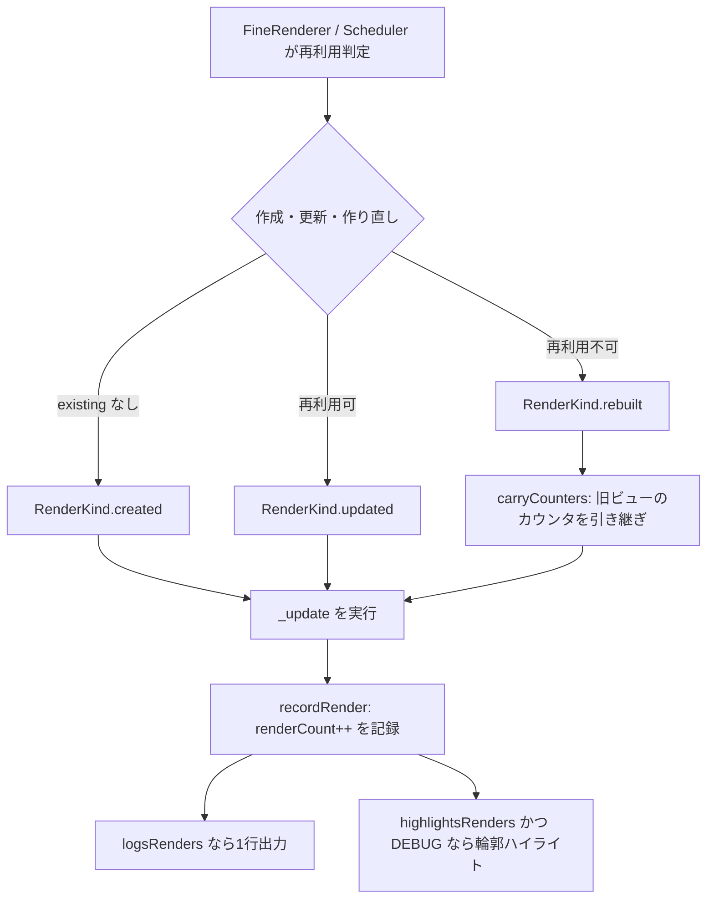

# レンダリング計測とデバッグ診断

差分ベースのランタイムでは「再構築された理由」は分かっても、「そもそも再レンダリングされたか、何回か」が読めないことが多いです。FineUIKit は `bd4d3a1` 以降、ランタイムが既に通る計測ポイントを利用する4つの計測器と2つのデバッガ内省 API を備えています。いずれも観測経路や再利用判定を変えず、[レンダリングワークフロー](../workflows/rendering.md)の既存経路の上に乗っています。`55d03e6` 以降は各ノードに「誰が再描画を頼んだか（`UpdateReason`）」と「その `_update` が何を要したか（`Duration`）」が常時記録され、カウンタの「ビューに何が起きたか」を補完します。`55b0545` 以降は、`makeView()` 内で読んだ `@Observable` 値が変わった瞬間に警告を報告する仕組みも備えています（後述）。

## レンダリング回数

各ビューには常に `renderCount`（その位置でレンダリングされた回数）と `rebuildCount`（うちビューを作り直した回数）が記録されます（[FineNode.swift](../../Sources/FineUIKit/FineNode.swift)）。フラグ不要・常時有効で、コストは整数のインクリメント2回です。

作り直しで新しいビューと `FineNode` が作られる際、カウンタは `FineDiagnostics.carryCounters(from:to:)` で引き継がれます。したがって数字はビュー個体ではなく**ツリー上の位置**を表します — 作り直しのたびにゼロリセットされれば、頻繁な再構築というまさに計測したいチャーンが隠れてしまいます。

計測は再利用判定の場所ではなく、`_update` が実行される場所で行われます。ノード局所再レンダリングは再利用判定を再訪しないため、そこで計測すると最も追跡が難しいレンダリングを見逃します。scheduler の経路は判定結果を `FineNode.pendingRenderKind` に記録し、キューに積んだ update がそれを消費します（[FineNodeScheduler.swift](../../Sources/FineUIKit/FineNodeScheduler.swift)）。



*計測は `_update` の実行点で行われ、ノード局所再レンダリングも再利用判定を経ずに同じ計測点に到達します。*

## FineDiagnostics の4つの計測器

`FineDiagnostics`（[FineDiagnostics.swift](../../Sources/FineUIKit/FineDiagnostics.swift)）はプロセス単位の切り替えを持ちます。`handler` を差し替えれば出力先をテストや自前のコンソールへ変更できます。

| 計測器 | 既定 | 環境変数 | 説明 |
|---|---|---|---|
| `logsViewReuse` | オフ | `FINEUIKIT_LOG_REUSE=1` | 再構築されたビューとその理由を1行ずつ報告 |
| `logsRenders` | オフ | `FINEUIKIT_LOG_RENDERS=1` | 再構築に至らない再レンダリングを含め全件を報告。1ビューにつき1行 |
| `highlightsRenders` | オフ | `FINEUIKIT_HIGHLIGHT_RENDERS=1` | 再レンダリングされたビューの輪郭を一瞬光らせる。DEBUG ビルド限定 |
| `showsInjectionToast` | オン | `FINEUIKIT_INJECTION_TOAST=0` で無効化 | コード注入が届いて再レンダリングされたとき画面上部にトースト表示。DEBUG ビルド限定 |

`logsRenders` は `logsViewReuse` より遥かにノイズが多い（ツリー全体の描画でビューごとに1行）ですが、再構築ログでは答えられない「再レンダリングされたか、何回か」に答えます。出力例（`55d03e6` 以降、理由と所要時間を含みます）:

```
FineUIKit created UILabel for FineLabel because it is new here (render #1, 0 rebuilt, 6.46 µs)
FineUIKit updated UILabel for FineLabel because a value it read changed (render #3, 0 rebuilt, 80.67 µs)
FineUIKit rebuilt UITextField for FineKeyed because its parent re-rendered (render #5, 1 rebuilt, 330.17 µs)
```

## なぜこのビューが更新されたのか

`55d03e6` 以降、各ノードは表示回数・作り直し回数に加え、**最終再描画の理由（`UpdateReason`）と所要時間（`Duration`）**を常時記録します（[FineNode.swift](../../Sources/FineUIKit/FineNode.swift) の `lastUpdateReason` / `lastUpdateDuration`）。計測器を事前に有効にしていなくても、後からデバッガやログで確認できるよう、フラグ非依存で保持します。カウンタは「ビューに何が起きたか」、`UpdateReason` は「誰が再描画を頼んだか」に答える、二つの異なる質問の組です。

| 理由 | `message`（`rendered because …`） | 意味 |
|---|---|---|
| `.initial` | it is new here | その位置での初回描画 |
| `.parent` | its parent re-rendered | 外側のスコープが再描画し、通り抜けた |
| `.observation` | a value it read changed | そのノード（またはホストするセル）が読んだ値が変わった |
| `.injection` | code was injected | コード注入が実装を差し替えた |

理由は「1 回の描画パスを記述する値」として振る舞います（`FineDiagnostics.pendingReason`）。スコープが宣言し（`FineDiagnostics.rendering(because:_:)`、`8ca4ec6` で set-and-forget から restore を伴うスコープへ）、最初に到達したノードが消費します。`FineRenderContext` で運ばないのは、context が子孫全員に同じ答えを渡してしまうためです — 子にとって真実は `parent` だからです（[`docs/diagnostics.md`](../../docs/diagnostics.md) §なぜこのビューが更新されたのか）。前段に `.observation`（root/trait）、`.injection`（`reloadInjectedCode`）、catch-up render（`FineRenderGate.resume()`）がそれぞれ宣言します。ノード局所復帰とセルホスト復帰は、ゲートが総括できないため、それぞれが自身の `.observation` を直接ノードへ設定します（commit `5d46acc`、`3d209b4`；経緯は[レンダリングワークフロー](../workflows/rendering.md)の停止・復帰節）。

「どのプロパティが変わったか」は分かりません — `withObservationTracking` は何かが変わったことしか報告せず、`.observation` が限界です（[`docs/diagnostics.md`](../../docs/diagnostics.md)）。特定の値で独立させたい場合は `FineLabel(text:)` の `@autoclosure` など、別ノードへ読み取りを逃す経路を使います。

`fineDebugDescription` / `fineDumpTree()`（[UIView+FineDebug.swift](../../Sources/FineUIKit/UIView+FineDebug.swift)）は、`because <message>` に続けて `fineFormatted(_:)` の所要時間列を出力します（ns / µs / ms から数を小さく保つ単位を選択）。例:

```
(lldb) po view.fineDumpTree()
FineStack → UIStackView  renders 1  because it is new here            330.17 µs
  FineLabel → UILabel    renders 2  because a value it read changed    80.67 µs
  FineLabel → UILabel    renders 1  because it is new here              6.46 µs
```

### 所要時間が意味する範囲

`8ca4ec6` と `3d209b4` が「実は覆っている範囲だけを主張する」形に直しました。`FineContentController`/scheduler 配下では各ノードの所要時間は**自身の `_update` だけ**です — コンテナの `_update` は子を scheduler へ渡して返り、子は別 job として計測されるため、枝を下った数値は**入れ子ではなく独立**で足し合わせることを意図しません。コンテナの値には子の**ビュー生成**（親の `_update` 中に起きる）は含まれますが、子の `_update` は含まれません。一方 `FineRenderer.render(_:reusing:)` を直接呼ぶ経路は scheduler を介さず `_update` が inline 再帰するため、**その経路の所要時間は子孫を含みます** — runtime と直接 render で意味が変わります（[`docs/diagnostics.md`](../../docs/diagnostics.md)）。かつての `incl. subtree` 表記は削除されました。

## 再レンダリングのハイライト

`FineDebugHighlight`（[FineDebugHighlight.swift](../../Sources/FineUIKit/FineDebugHighlight.swift)）は再レンダリングされたビューの輪郭を専用のサブレイヤーで一瞬光らせます。**緑 = in-place 更新、赤 = 作り直し**で、数値は累計レンダリング回数です。`logsViewReuse` が言葉で報告する区別を視覚化します。

ビュー自身の `layer.border` ではなくサブレイヤーを重ねるため、枠線を持つコンポーネントの見た目を壊さず、タップも吸いません。繰り返しレンダリングされるビューはオーバーレイが積み重ならず、1つのレイヤーが再利用されます。DEBUG ビルド限定で、フレームレート計測時はオフにしてください（オーバーレイの描画コストが計測対象を上回ります）。

## 注入トースト

`FineDebugToast`（[FineDebugToast.swift](../../Sources/FineUIKit/FineDebugToast.swift)）はコード注入が届いて再レンダリングが走ったことを画面上部にトーストで知らせます。ホットリロードの2つの失敗 — 「注入が届いていない（ツール-chain の問題）」と「届いたが記述が変わらなかった（コードの問題）」— は画面上同じに見えますが、前者だけが無音です。この区別が切り分けの起点になります。

全ライブツリーが同じ通知で再レンダリングするため、トーストはツリーごとに1枚重ねるのではなく件数をカウントし `×3` のように1枚に統合します。タップを吸わないよう `isUserInteractionEnabled = false` です。DEBUG ビルド限定、`FineDiagnostics.showsInjectionToast` で制御します。

## makeView() で状態を読んだ場合の警告

`FineViewRepresentable.makeView()` は**ビュー identity ごとに1回**しか呼ばれず、**再レンダリングを起こす観測スコープの外**で実行されます（そのように追跡されるのは `_update` だけです）。そのため、ここで `@Observable` な値を読んでも「後の変更を反映できる登録」は行われず、値が変わっても**何も起きません** — 再レンダリングもエラーも無く、ビューは最初の値を表示し続けます。doc comment はこれを禁じていましたが、違反しても何も知らせないため、問題に気づけないままでした。

`55b0545` 以降、`FineDiagnostics.makingView(of:_:)`（[FineDiagnostics.swift](../../Sources/FineUIKit/FineDiagnostics.swift)）が `makeView()` を**監視だけを行う観測スコープ**で包みます。このスコープは `withObservationTracking` の通知を受け取るだけで何も無効化しないため、**ランタイムの言うことは変わっても、やることは変わりません**。observable を読まない記述はクロージャ呼び出し1回で何も登録せず、読んでも変わらなければ何も報告しません。報告は**値が実際に変化した時点**で行われます — それがバグが現実になる瞬間であり、`makeView` を疑う頃には誰もここを見ていないためです。

コンポーネント名の解決は `FineNode.primitiveName` と同じ `_viewProvider` を使うため、メッセージはラッパーではなく `Badge` のような読者が認識できる名前を報告します。出力先は `FineDiagnostics.handler`（既定は `OSLog`）で、DEBUG ビルド限定です。

```text
FineUIKit FineRepresentableAdapter<Badge>: a value read while creating its view has changed.
makeView() runs once per view identity, and outside the observation scope that re-renders —
so that read registered nothing able to apply the change. Unless updateView(_:environment:)
writes the same value, the view is now stale. Reading state in updateView is what makes it
follow.
```

ビュー生成の両経路 — `FineRenderer.render(_:reusing:)`（テストが使う同期経路）と `FineNodeScheduler`（マウントされたツリーが通る経路）— がこの監視を経由します（[FineRenderer.swift](../../Sources/FineUIKit/FineRenderer.swift)、[FineNodeScheduler.swift](../../Sources/FineUIKit/FineNodeScheduler.swift)）。

assert ではなくメッセージなのは、`makeView` と `updateView` の**両方**で同じ値を読んでいる場合をランタイムが区別できないためです。この形はビューとしては `updateView` 側の読み取りで正しく更新されますが、`makeView` 側の読み取りは何もしていません。ランタイムには「別の場所での読み取りが面倒を見ている」ことが見えないため、どちらも報告します。**修正は読み取りを `updateView(_:environment:)` に移すこと** — こちらは毎レンダリング呼ばれ、観測スコープの内側です。この契約と利用上の注意は[UI 合成と状態](../domain/ui-composition.md#任意の-uikit-view-を接続する)が正本です。

## デバッガからの内省

`UIView` の `fineDebugDescription` と `fineDumpTree()`（[UIView+FineDebug.swift](../../Sources/FineUIKit/UIView+FineDebug.swift)）は、Xcode の View Debugger が見せない「ビューを作ったコンポーネント・key・モディファイア署名」を名付けます。UIKit の標準ビューにレンダリングするため、`debugDescription` の override ではなくデバッガ専用 API として実装されています。

```
(lldb) po view.fineDumpTree()
FineStack → UIStackView  renders 2  because its parent re-rendered       330.17 µs
  FineLabel → UILabel  renders 2  because a value it read changed  modifiers "|padding"  80.67 µs
  FineKeyed → UITextField  renders 5  rebuilds 1  because code was injected  key draft  state
  UIView (unmanaged)

(lldb) po someLabel.fineDebugDescription
FineLabel → UILabel  renders 3  hidden
```

FineUIKit が管理していないビューは `unmanaged` と表示されます。どちらも observable な状態を読まないため、ブレークポイントから呼んでもレンダリングループを乱しません。詳しい出力例は [`docs/diagnostics.md`](../../docs/diagnostics.md) の診断セクションが正本です。

## コンポーネント名の解決とキャッシュ

デバッグ説明が「モディファイアのラッパー」ではなく「ビューを作ったコンポーネント」を名付けるため、`FinePrimitiveRenderable._viewProvider`（[Renderable.swift](../../Sources/FineUIKit/Renderable.swift)）がコンポーネントを解決します。コンテンツのビューへ描画する transparent モディファイア（`FineStyled`、`FineKeyed`、`FineConstrained`、`FineCustomConstrained`、`FineTapModified`、`FineEnvironmentWriter`）は `_viewProvider` で内側のコンテンツを返し、自身のビューを持つモディファイア（`FinePadded`、`FineFramed`）は自身を返します。

`e93eb62` はこの解決を毎レンダーではなくノードごとに1回にキャッシュしました。モディファイアが composite のコンテンツを透過するには `body` を辿る必要があり、毎レンダー全ビューで実行すれば release ビルドでも description 解決のコストが再発するためです。`FineNode.noteRender(of:)` は description 型の `ObjectIdentifier` でキャッシュし、型が変われば再構築で別ノードになるため steady state はメタ型比較1回で済みます。1つの既知の例外は「同じモディファイア型 over 異なるコンテンツが同じビュークラスを作る」場合で、全ビューで `body` を辿るコストがデバッグラベルの価値を超えるため許容されています。

## Signpost

`FineSignpost`（[FineSignpost.swift](../../Sources/FineUIKit/FineSignpost.swift)）は3つのレンダリングループを Points of Interest に記録します。Time Profiler や Animation Hitches の標準テンプレートでそのまま見えるため、専用テンプレートは不要です。計測ツールが記録していなければ何も出力されないため、release ビルドにも残ります。

| 区間 | 意味 | 名前 |
|---|---|---|
| `render` | ルートの再レンダリング（`body(_:)` の再評価とツリー再 diff） | state 型名 |
| `node` | ノード単位の更新（観測起因のノードローカル再レンダリングを含む） | コンポーネント名 |
| `cell` | リスト / グリッドのセルが抱えるサブツリー | 最後にホストしたコンポーネント名、初回は `new` |

`render` 区間は [FineUI.swift](../../Sources/FineUIKit/FineUI.swift) の `render()` で、`node` は `FineNodeScheduler` の update 実行で、`cell` は [FineNodeHost.swift](../../Sources/FineUIKit/FineNodeHost.swift) の apply で囲みます。

## 変更時の確認

- カウンタや計測器を変更する: `FineDebugTests.swift` と `FineDiagnosticsTests.swift` を確認します。ハイライト・トーストはプロセス単位のフラグを使うため `@Suite(.serialized)` で直列化されています。
- makeView() 観測診断を変更する: `FineMakeViewObservationTests.swift` を確認します。makeView で読んだ値の変化が報告されること、updateView で読んだ値は報告されないこと、observable を読まないツリーは無言であること、報告がタスク経由で届くためテストは yield 回数ではなくメッセージを待つこと（commit `55b0545`、`8d143f5`）。
- 更新理由・所要時間を変更する: `FineUpdateReasonTests.swift`（初回 `.initial`、親起因 `.parent`、観測 `.observation`、catch-up、セルの自己復帰、子へ漏れないこと、理由が漏れないこと、所要時間の記録、`fineDebugDescription` の `because` 含有）と `FineDurationFormattingTests` を確認します。理由の宣言は「ゲートは catch-up だけ、ノード局所とホストはそれぞれ自身」の分離を壊さないでください（commit `3d209b4`）。
- `_viewProvider` を持つモディファイアを追加する: コンテンツのビューへ描画するなら `_viewProvider` で内側を返し、自身のビューを持つならデフォルト（自身）のままにします。`looksThroughEveryModifierThatSharesAView` が全 transparent モディファイアを検査します。
- 計測ポイントを移動する: 計測は `_update` の実行点にあることでノード局所再レンダリングを取りこぼさない点に注意してください。再利用判定の場所へ移動すると、ノード局所再レンダリングがカウントされなくなります。

テストの実行方法と変更別選択は[テストと運用](testing.md)、観測経路そのものは[レンダリングワークフロー](../workflows/rendering.md)、`FineNode` の構造は[レンダリングランタイムの構造](../architecture/overview.md)を参照してください。
