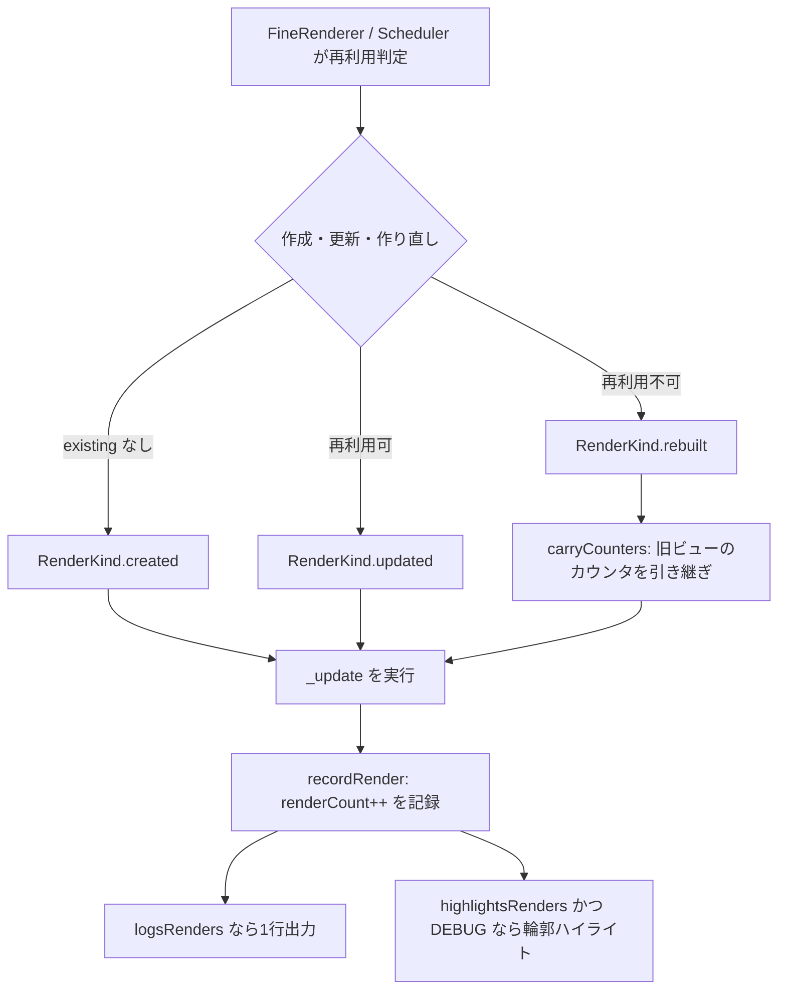

# レンダリング計測とデバッグ診断

差分ベースのランタイムでは「再構築された理由」は分かっても、「そもそも再レンダリングされたか、何回か」が読めないことが多いです。FineUIKit は `bd4d3a1` 以降、ランタイムが既に通る計測ポイントを利用する4つの計測器と2つのデバッガ内省 API を備えています。いずれも観測経路や再利用判定を変えず、[レンダリングワークフロー](../workflows/rendering.md)の既存経路の上に乗っています。

## レンダリング回数

各ビューには常に `renderCount`（その位置でレンダリングされた回数）と `rebuildCount`（うちビューを作り直した回数）が記録されます（[FineNode.swift](../../Sources/FineUIKit/FineNode.swift)）。フラグ不要・常時有効で、コストは整数のインクリメント2回です。

作り直しで新しいビューと `FineNode` が作られる際、カウンタは `FineDiagnostics.carryCounters(from:to:)` で引き継がれます。したがって数字はビュー個体ではなく**ツリー上の位置**を表します — 作り直しのたびにゼロリセットされれば、頻繁な再構築というまさに計測したいチャーンが隠れてしまいます。

計測は再利用判定の場所ではなく、`_update` が実行される場所で行われます。ノード局所再レンダリングは再利用判定を再訪しないため、そこで計測すると最も追跡が難しいレンダリングを見逃します。scheduler の経路は判定結果を `FineNode.pendingRenderKind` に記録し、キューに積んだ update がそれを消費します（[FineNodeScheduler.swift](../../Sources/FineUIKit/FineNodeScheduler.swift)）。



*計測は `_update` の実行点で行われ、ノード局所再レンダリングも再利用判定を経ずに同じ計測点に到達します。*

## FineDiagnostics の4つの計測器

`FineDiagnostics`（[FineDiagnostics.swift](../../Sources/FineUIKit/FineDiagnostics.swift)）はプロセス単位の切り替えを持ちます。`handler` を差し替えれば出力先をテストや自前のコンソールへ変更できます。

| 計測器 | 既定 | 環境変数 | 説明 |
|---|---|---|---|
| `logsViewReuse` | オフ | `FINEUIKIT_LOG_REUSE=1` | 再構築されたビューとその理由を1行ずつ報告 |
| `logsRenders` | オフ | `FINEUIKIT_LOG_RENDERS=1` | 再構築に至らない再レンダリングを含め全件を報告。1ビューにつき1行 |
| `highlightsRenders` | オフ | `FINEUIKIT_HIGHLIGHT_RENDERS=1` | 再レンダリングされたビューの輪郭を一瞬光らせる。DEBUG ビルド限定 |
| `showsInjectionToast` | オン | `FINEUIKIT_INJECTION_TOAST=0` で無効化 | コード注入が届いて再レンダリングされたとき画面上部にトースト表示。DEBUG ビルド限定 |

`logsRenders` は `logsViewReuse` より遥かにノイズが多い（ツリー全体の描画でビューごとに1行）ですが、再構築ログでは答えられない「再レンダリングされたか、何回か」に答えます。出力例:

```
FineUIKit updated UILabel for FineLabel (render #3, 0 rebuilt)
FineUIKit rebuilt UITextField for FineKeyed (render #5, 1 rebuilt)
```

## 再レンダリングのハイライト

`FineDebugHighlight`（[FineDebugHighlight.swift](../../Sources/FineUIKit/FineDebugHighlight.swift)）は再レンダリングされたビューの輪郭を専用のサブレイヤーで一瞬光らせます。**緑 = in-place 更新、赤 = 作り直し**で、数値は累計レンダリング回数です。`logsViewReuse` が言葉で報告する区別を視覚化します。

ビュー自身の `layer.border` ではなくサブレイヤーを重ねるため、枠線を持つコンポーネントの見た目を壊さず、タップも吸いません。繰り返しレンダリングされるビューはオーバーレイが積み重ならず、1つのレイヤーが再利用されます。DEBUG ビルド限定で、フレームレート計測時はオフにしてください（オーバーレイの描画コストが計測対象を上回ります）。

## 注入トースト

`FineDebugToast`（[FineDebugToast.swift](../../Sources/FineUIKit/FineDebugToast.swift)）はコード注入が届いて再レンダリングが走ったことを画面上部にトーストで知らせます。ホットリロードの2つの失敗 — 「注入が届いていない（ツール-chain の問題）」と「届いたが記述が変わらなかった（コードの問題）」— は画面上同じに見えますが、前者だけが無音です。この区別が切り分けの起点になります。

全ライブツリーが同じ通知で再レンダリングするため、トーストはツリーごとに1枚重ねるのではなく件数をカウントし `×3` のように1枚に統合します。タップを吸わないよう `isUserInteractionEnabled = false` です。DEBUG ビルド限定、`FineDiagnostics.showsInjectionToast` で制御します。

## デバッガからの内省

`UIView` の `fineDebugDescription` と `fineDumpTree()`（[UIView+FineDebug.swift](../../Sources/FineUIKit/UIView+FineDebug.swift)）は、Xcode の View Debugger が見せない「ビューを作ったコンポーネント・key・モディファイア署名」を名付けます。UIKit の標準ビューにレンダリングするため、`debugDescription` の override ではなくデバッガ専用 API として実装されています。

```
(lldb) po view.fineDumpTree()
FineStack → UIStackView  renders 2
  FineLabel → UILabel  renders 2  modifiers "|padding"
  FineKeyed → UITextField  renders 5  rebuilds 1  key draft  state
  UIView (unmanaged)

(lldb) po someLabel.fineDebugDescription
FineLabel → UILabel  renders 3  hidden
```

FineUIKit が管理していないビューは `unmanaged` と表示されます。どちらも observable な状態を読まないため、ブレークポイントから呼んでもレンダリングループを乱しません。詳しい出力例は [`README.md`](../../README.md) の診断セクションが正本です。

## コンポーネント名の解決とキャッシュ

デバッグ説明が「モディファイアのラッパー」ではなく「ビューを作ったコンポーネント」を名付けるため、`FinePrimitiveRenderable._viewProvider`（[Renderable.swift](../../Sources/FineUIKit/Renderable.swift)）がコンポーネントを解決します。コンテンツのビューへ描画する transparent モディファイア（`FineStyled`、`FineKeyed`、`FineConstrained`、`FineCustomConstrained`、`FineTapModified`、`FineEnvironmentWriter`）は `_viewProvider` で内側のコンテンツを返し、自身のビューを持つモディファイア（`FinePadded`、`FineFramed`）は自身を返します。

`e93eb62` はこの解決を毎レンダーではなくノードごとに1回にキャッシュしました。モディファイアが composite のコンテンツを透過するには `body` を辿る必要があり、毎レンダー全ビューで実行すれば release ビルドでも description 解決のコストが再発するためです。`FineNode.noteRender(of:)` は description 型の `ObjectIdentifier` でキャッシュし、型が変われば再構築で別ノードになるため steady state はメタ型比較1回で済みます。1つの既知の例外は「同じモディファイア型 over 異なるコンテンツが同じビュークラスを作る」場合で、全ビューで `body` を辿るコストがデバッグラベルの価値を超えるため許容されています。

## Signpost

`FineSignpost`（[FineSignpost.swift](../../Sources/FineUIKit/FineSignpost.swift)）は3つのレンダリングループを Points of Interest に記録します。Time Profiler や Animation Hitches の標準テンプレートでそのまま見えるため、専用テンプレートは不要です。計測ツールが記録していなければ何も出力されないため、release ビルドにも残ります。

| 区間 | 意味 | 名前 |
|---|---|---|
| `render` | ルートの再レンダリング（`body(_:)` の再評価とツリー再 diff） | state 型名 |
| `node` | ノード単位の更新（観測起因のノードローカル再レンダリングを含む） | コンポーネント名 |
| `cell` | リスト / グリッドのセルが抱えるサブツリー | 最後にホストしたコンポーネント名、初回は `new` |

`render` 区間は [FineUI.swift](../../Sources/FineUIKit/FineUI.swift) の `render()` で、`node` は `FineNodeScheduler` の update 実行で、`cell` は [FineNodeHost.swift](../../Sources/FineUIKit/FineNodeHost.swift) の apply で囲みます。

## 変更時の確認

- カウンタや計測器を変更する: `FineDebugTests.swift` と `FineDiagnosticsTests.swift` を確認します。ハイライト・トーストはプロセス単位のフラグを使うため `@Suite(.serialized)` で直列化されています。
- `_viewProvider` を持つモディファイアを追加する: コンテンツのビューへ描画するなら `_viewProvider` で内側を返し、自身のビューを持つならデフォルト（自身）のままにします。`looksThroughEveryModifierThatSharesAView` が全 transparent モディファイアを検査します。
- 計測ポイントを移動する: 計測は `_update` の実行点にあることでノード局所再レンダリングを取りこぼさない点に注意してください。再利用判定の場所へ移動すると、ノード局所再レンダリングがカウントされなくなります。

テストの実行方法と変更別選択は[テストと運用](testing.md)、観測経路そのものは[レンダリングワークフロー](../workflows/rendering.md)、`FineNode` の構造は[レンダリングランタイムの構造](../architecture/overview.md)を参照してください。
