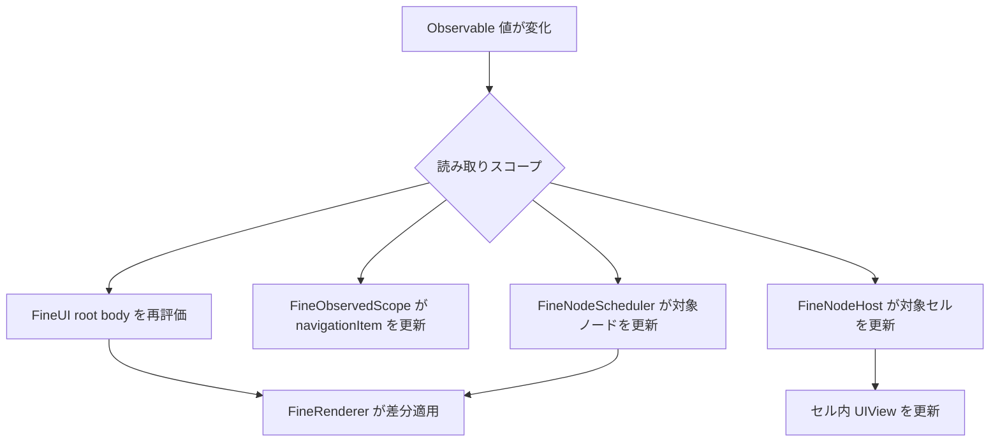
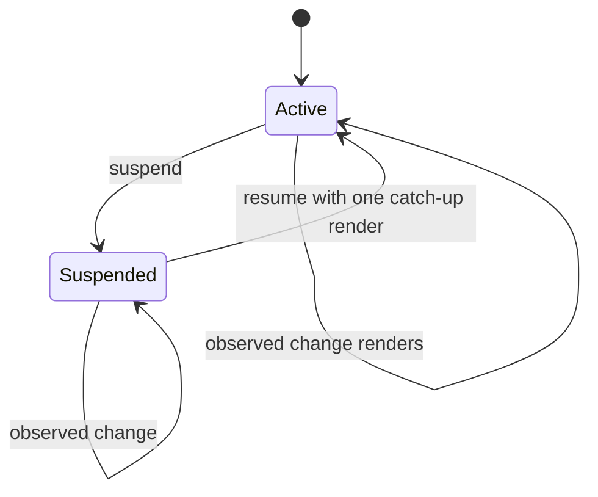

# 観測・再調停・可視性のワークフロー

FineUIKit は「どこで Observable 値を読んだか」により更新の粒度を選びます。基盤となる構成要素の役割は[レンダリングランタイムの構造](../architecture/overview.md)にあり、このページは実行時の経路と変更時の注意を定義します。

*同じ状態変更でも、読み取り位置に応じてツリー全体、ナビゲーション、単一ノード、単一セルのいずれかだけを更新します。*

## 1. root の構造変更

`FineUI.render()` は `content.body()` の**解決まで**を `withObservationTracking` 内で行います。`if`、配列の構造、モディファイア引数のように、記述を組み立てる最中に読まれた値が変わると root が再評価され、`FineRenderer` が前回の root view と差分適用します（[FineUI.swift](../../Sources/FineUIKit/FineUI.swift)）。

解決（`FineRenderer.primitive(for:)`）も tracking の内側であることが重要です。content が返す記述がアプリ側の `Renderable` 型である場合、その `body` を辿って primitive に至るまでに読む値は解決の最中に読まれます。解決を tracking の外に置くと、root 直下に置いた composite が `body` で分岐に使った observable がどのスコープにも属さず、初回以降まったく更新されません。木の奥では同じ解決がノードの `_update` 内で起きるため、もともと scheduler に追跡されていました。`FineCompositeObservationTests` がこの root 経路を固定しています（[`Sources/FineUIKit/FineUI.swift`](../../Sources/FineUIKit/FineUI.swift) の `render()` コメント参照）。

`body()` をクロージャではなくメソッドにしているのはコード注入で差し替えられるようにするためです(`9864cee` で `FineUI<State>` の stored closure から `any FineContent` の method へ移行した理由)。差し替えの単位はシンボル（symbol interposition）であって vtable ではなく、content を `final class` で書く限り `-Xlinker -interposable` が必須です。`final` は推奨ではなく要件です — 非 `final` な class は vtable パッチという別経路で差し替わりますが、メソッドの追加・削除でクラッシュします。経路の区別と実測の根拠は [`docs/api-design.md`](../../docs/api-design.md) §2–§3 と [`docs/hot-reload.md`](../../docs/hot-reload.md) のホットリロード節が正本です。

ここでは `FineNodeScheduler` を新たに用意し、子ノードの更新をキューへ積んで `drain()` します。古い render や observation callback は generation で捨てるため、作り直されたビューに stale な更新が入らない設計です（[FineNodeScheduler.swift](../../Sources/FineUIKit/FineNodeScheduler.swift)）。

## 2. ノード局所更新

primitive の `_update` 内で読まれた値は、scheduler がノードごとの `withObservationTracking` で追跡します。たとえば `FineLabel(text: state.title)` はラベル更新時に `title` を読むため、変更時はラベルのノードだけが再更新されます。root の構造を変えない値を eager に `body` 内で読むと root scope になるため、読み取り位置が性能と更新範囲を決めます。

この経路は `FineState` の局所更新にも使われます。identity をまたぐ状態保持の条件は[UI 合成と状態](../domain/ui-composition.md)を参照してください。

## 3. ナビゲーションとセルは独立スコープ

`FineNavigating.navigation()` は `FineObservedScope` で追跡されます。`FineContentController` は `viewDidLoad` で content が `FineNavigating` に適合しているときだけこの scope を構築します(`7f7602d` 以降、非適合 content では `viewDidLoad` の後続処理を打ち切らない)。タイトルや bar button の enabled 状態だけが変わったとき、view tree は再調停せず `navigationItem` だけ更新されます（[FineContentController.swift](../../Sources/FineUIKit/FineContentController.swift)、[FineObservedScope.swift](../../Sources/FineUIKit/FineObservedScope.swift)）。

List/Grid のセルと supplementary view は `FineNodeHost` で個別に観測されます。セル内で読んだ値は該当セルだけを更新し、可視セルに伝える environment もこの経路で反映されます。diffable data source とセル再利用の詳細は[UIKit 統合とコレクション](../integrations/uikit-collections.md)に分離しています。

## 4. 非表示ツリーの停止と復帰

`FineRenderGate` は画面外の observation 起因作業を止めます。`FineContentController` は標準で `viewDidDisappear` に suspend、`viewIsAppearing` に resume を呼び、停止中の変更は一回のアニメーションなし catch-up render にまとめます。

`89d9164` 以降、停止の理由は二つに分かれています。`isSuspendedOffScreen`（画面外による停止）と `isSuspendedByCaller`（`suspendRendering()` による明示的停止）は独立し、いずれかが有効な間だけ runtime が suspend します（`applySuspension()`）。したがって `suspendRendering()` で要求した停止は `viewIsAppearing` でも解除されず、`resumeRendering()` だけで終わります。`suspendsWhenDisappeared` を `false` にoverride すると画面外停止を無効化できます（snapshotted な遷移ビューなど）。`.overFullScreen` / `.overCurrentContext` で覆われる場合と、ロード後に一度も表示されない場合は `suspendRendering()` / `resumeRendering()` で手動制御します。

*`build(to:)` の初回描画は停止せず、停止中に届いた変更だけが復帰時に集約されます。*

セルは特殊です。未変更の row は catch-up で reconfigure されないため、停止中に観測が無効化されたセルは gate へ自身の復帰処理を登録します。これにより、セルが stale のまま残ることを防ぎます（[FineRenderGate.swift](../../Sources/FineUIKit/FineRenderGate.swift)、[FineNodeHost.swift](../../Sources/FineUIKit/FineNodeHost.swift)）。

## 変更時の確認

- root / node / navigation のスコープを変える場合: `FineRenderScopeTests.swift`。navigation-only の更新が body を再描画しないこと、非表示画面が一回だけ catch-up することを確認します。
- root 直下の composite が読む observable のトラッキングを変える場合: `FineCompositeObservationTests.swift`。解決を tracking の内側に保つ回帰です。
- generation、セル回復、可視性ゲートを変える場合: `FineRenderScopeTests.swift` と `FineListBehaviorTests.swift` を合わせて確認します。
- `body` 解決や再利用を変える場合: `FineUIKitTests.swift` と性能テストも確認します。`044f24d` 以降、同一 description の余分な解決を増やさないことが重要です。composite 型の identity（通り過ぎた型が署名に入ること）は `FineCompositeTests.swift` が固定します。

具体的なコマンドとテストの選択は[テストと運用](../operations/testing.md)、ファイルの担当境界は[ソースマップ](../source-map.md)を参照してください。
